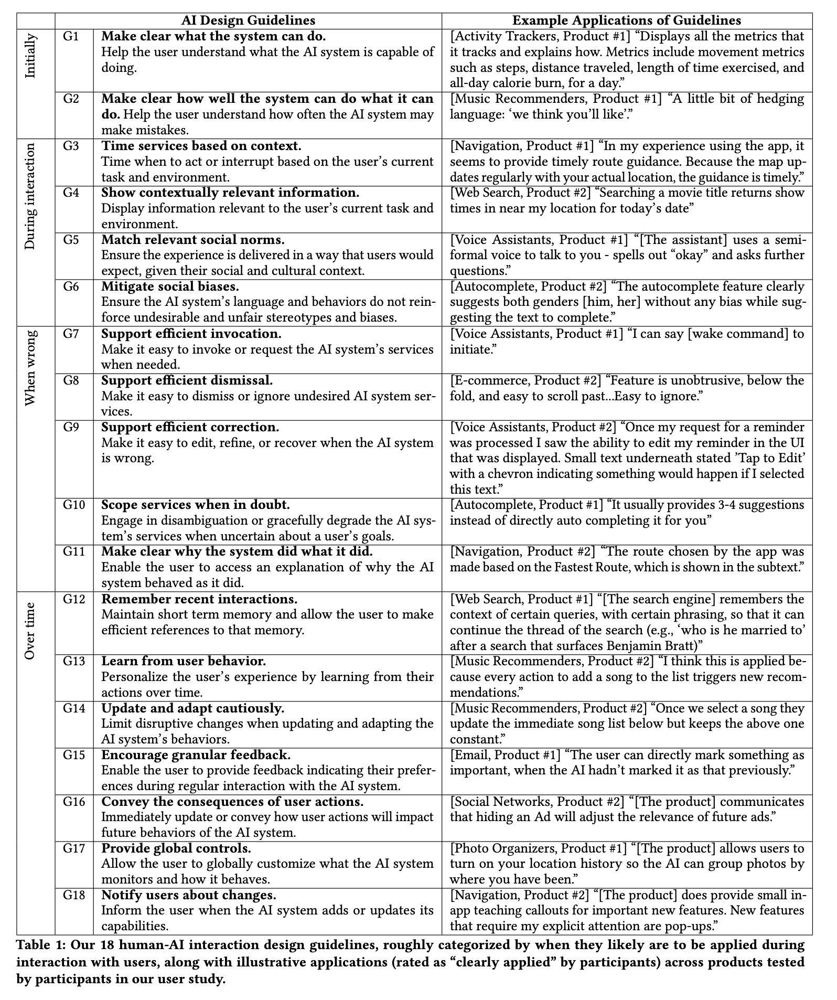
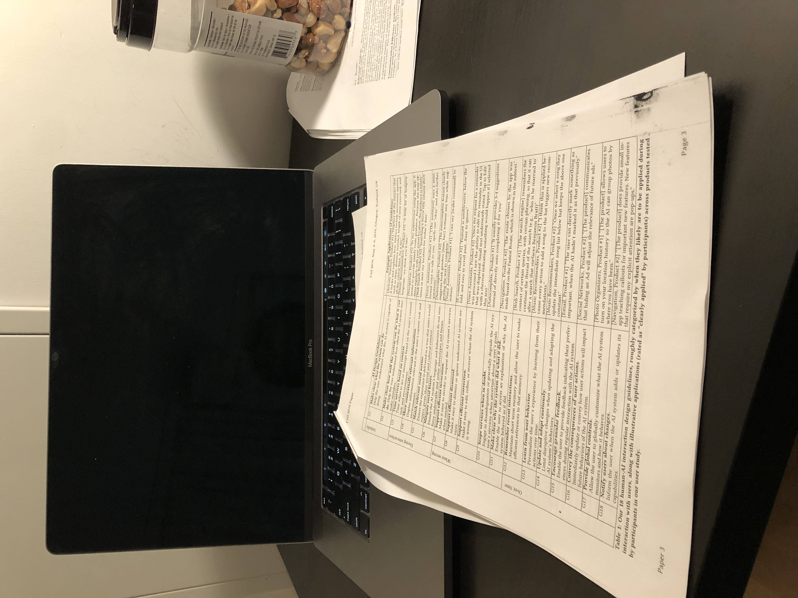

## What?

This paper proposed 18 design guidelines for human-ai interactions.

## Why?

The motivations are that 1) there are needs in studies and innovations in light of advances in AI and the growing uses of AI technologies in human-facing applications, and 2) these AI-infused systems can violate established usability guidance of traditional user interface design. In particular, the uniqueness of AI systems is their uncertained performance, often producing false positive, and false negative. This make it dfficult for users to predict their behaviors therefore efficiently use them.

## Nuggets

The study found that some guidances emerged as relevant but not widely implemented. For instance, G11 "Make clear why the system did what it did" had one of the highest number of violations rated by the participants on the tested products, despite the large volumn of active research in the area of intelligibility and explanation.

## Results

## Where

