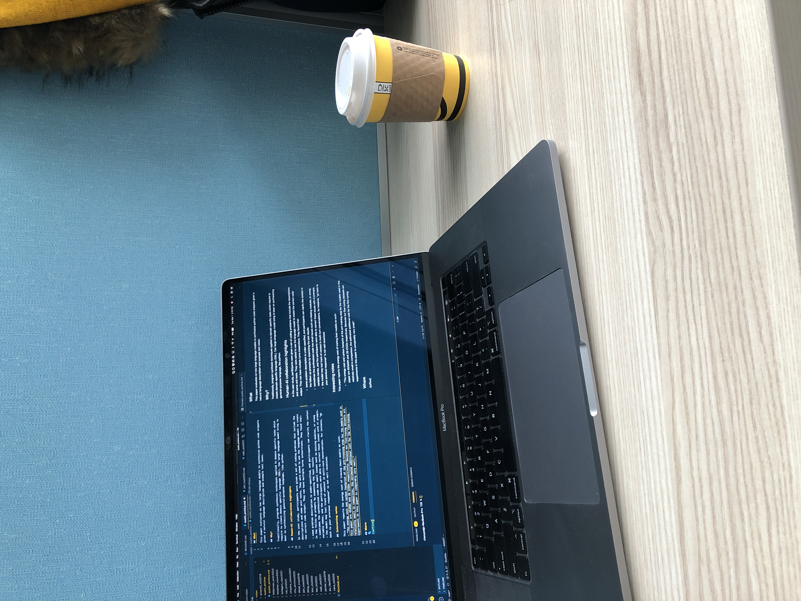

## What

This paper evaluates on two large language models to synthesize python code snippets given a natural language description and example test cases.

## Why?

Traditionally, program synthesis techniques applied to domain specific tasks which require to create domain specific language (DSL). Can large language model bring to bear on synthesizing general-purpose language, like python.

## Human-AI collaboration highlights

In the user study, participants were given a set of coding problems that include the descriptions and some unit tests. They were asked to use the language model to create the correct code output. They can have multiple turns intearctions. They found that:

- some problem description is under-specified, and participants can clarify the context in the follow up prompts by examining the test results
- sometimes the synthesized code has small issues such as missing modules, or wrong variable names, and the participants were able to correct thses issues with nl prompts.
- the model may lost track of context in multi-turn conversations. for instance, "go back to your previous response" is not well reconized.

## Interesting notes

This paper reports the energy cost of traning their models as such:

- "The energy cost and carbon footprint of the pre-training step for the models used in this paper are 451MWh and 26 tCO2e respectively. Because our fine-tuning datasets are relatively small in comparison, the estimated additional cost for the fine-tuning experiments in this paper is comparably very small."

## Where

