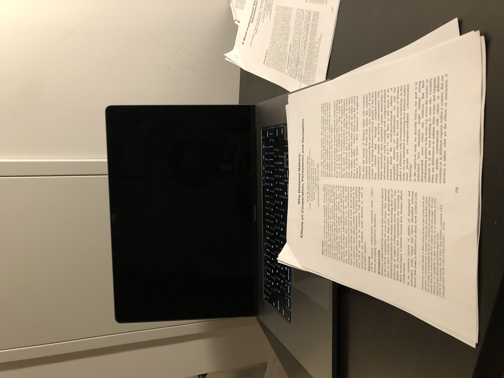

## What

This study paper examined the effects of the coorperated partners being in the same or in distant city on three behaviors: coorperation, persuasion, and deception using video conferencing and instant messaging.

## Why

The topic of distance collaboration is more relevant now than ever, as geographically distributed organizations are steadily increasing their use of technology to support collaboration across distance. Yet, it remains unclear how distance affects collaboration.

## Methods

They did a between-subject study with 2 factors: distance (near or far), media type (video, text). Each session has one participant and one confederate (same person over all sessions). They together will play three games which correspond to the three behaviors that the authors try to examine.

## Findings

The perceived geographical distance of a coorperating partner affects one's willingness to initially collaborate with, be persuaded by, and deceive that partner. How?

- Coorperation: If they believe their partner is far, they coorperate less initially. But coorperation increases with interaction. No change if they believe the partner is nearby.
- Persuasion: They are less persuaded by a person if they believe this person is fac
- Deception: They are more likely to give deceptive (positive: i've never xx) portrayals about themselves to a partner that they believe to be in a distant city.

## Discussion (how to explain these findings)

Social identity theory and social impact theory best characterize these findings.

- Social identity theory: People evaluate the skills of those near them to be suprior to the skils of distant others. So they are more persuaded by the near ones.
- Social impact theory: If people know they are disadvantaged by distance, they may stretch the truth to compensate.

## Implications

These findings can help guide the design of collaboration techniques by tuning the perceived distance between partners for optimzing the outcome of the three behaviors.

## Where

