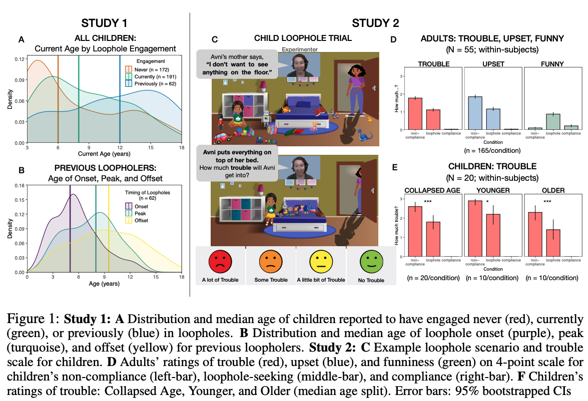
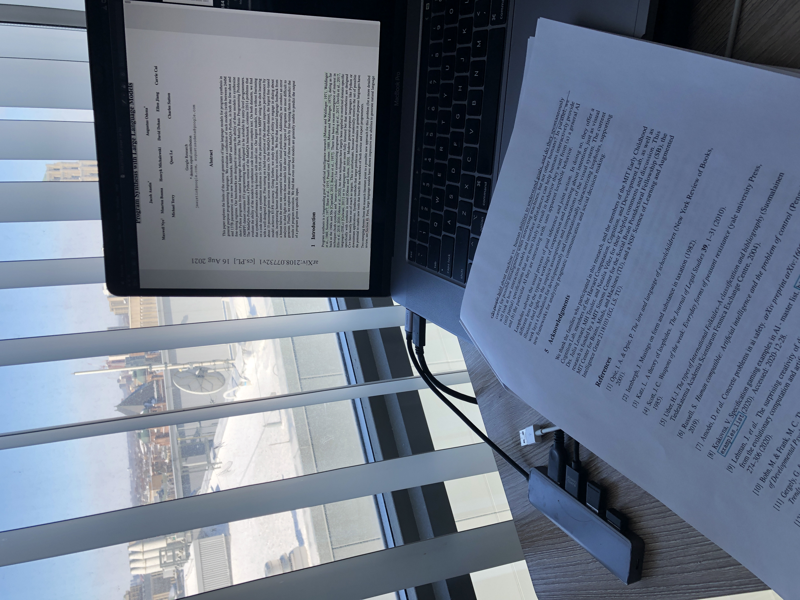

## What

This paper conducted a preliminary study to exploit the loophole behavior, taking advantages of the ambiguity of language to do what someone says but not what they mean, in parent-child interactions.

## How

They conducted a survey on the age distribution of loophole onset, peak, and offset. Also, they conducted a study that asked parents and children to assess a set of scenarios regarding trouble, upset, and funny.

## Findings

Loophole is prevalent, diverse, and frequent in daily interactions.

## Implication for human-ai interactions

Formal framework: Rational Speech Act(RSA) framework formulates the coorperative act between a speaker and a listener

- what is being asked (the speakers' goal)
- what are my own goals (the listener's goal)
- how best to align the two (the trade-ff between goals)

Plans of investigation:

- how people think about machines as social partners or their 'intuitive theory of AI'
- what assumptions do people hold about machine vs. human abilities to understand goals
- do they spontaneously correct for possible misalignment when instructing machines, but not other humans?

## Where

