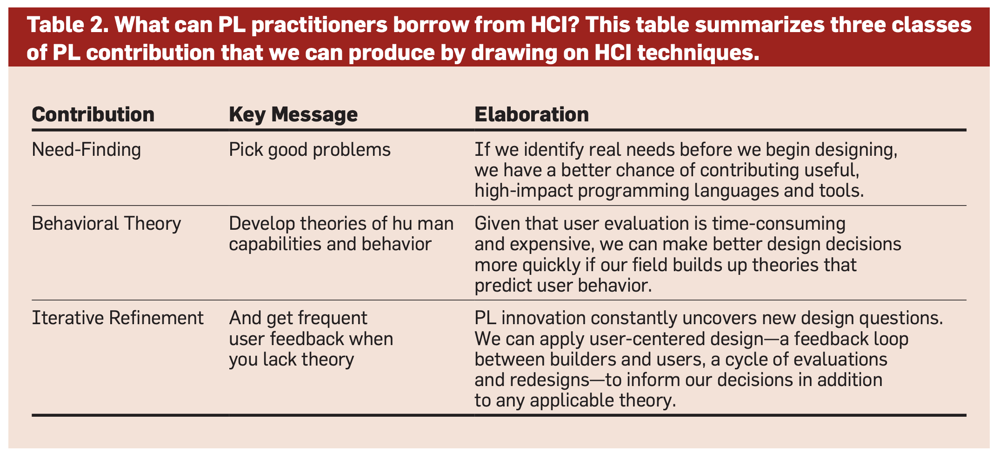
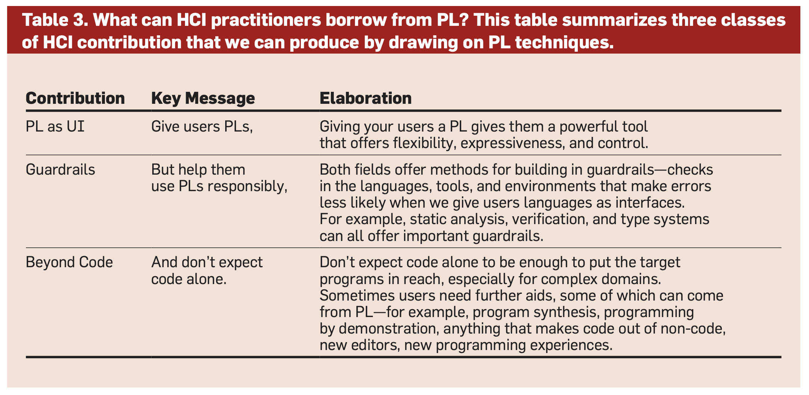

## What

This is a review article that advocates more efforts on the interaction research area between PL and HCI.

## Other fields that are relevant

- Psychology of programming (PoP) community has a long history of studying how users deal with PL (Alan Black [1])
- CS education is another area where it makes it easier for people to learn CS.

[1]. Black et al. Fifty years of Psychology of programming 2019.

## Takeaways

The paper lists a few PL research contributes that future researchers can make:

- standalone need-finding studies for populations, settings, and tasks that could be particularly well-served by novel programming language research.
  - There's a huge opportunity to design experiments to generate language-relevant theory.
- Theory development and theory transfer, for predicting human cognition and behavior during interaction with programming systems.
  - Specific users' needs that can help design the interactions.
- Language and tool designs guided by user-centered, iterative design processes.

The paper also lists a few HCI research contributes that future researchers can make:

- Developing/Studying PL as UIs
- Developing/Studying techniques for efficent and usesable UIs
- Developing/Studying techniques for easy user intent communication/specification

Here are the two corresponding tables from the paper:

## Where

