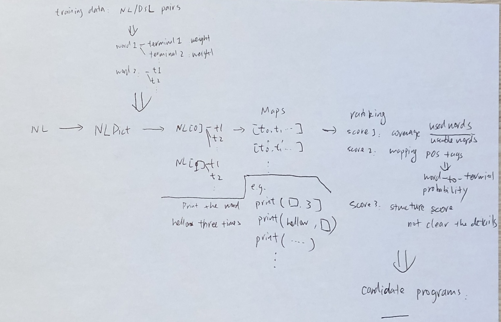
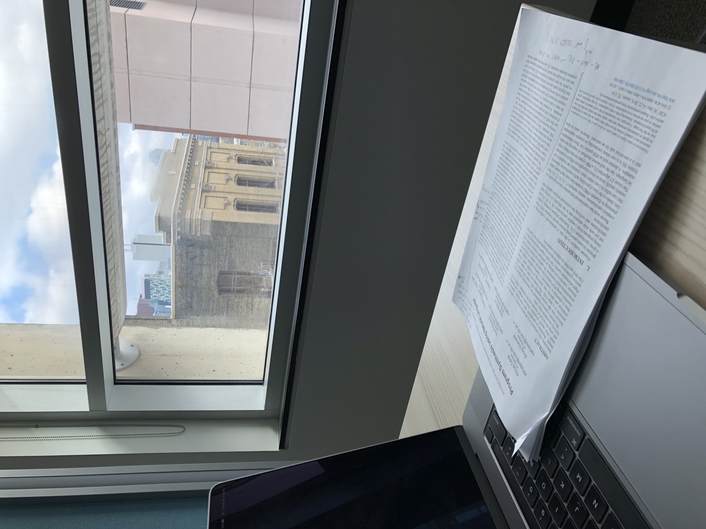

## What

This is one of the earliest papers that proposed the framework for translating NL inputs to computer programs. It has two technical components: a NL/DSL dictionary with learned weights, and a NLP classifier that ranks the outputs of a keyword-programming based translation.

This diagram i drew shows the technique pipeline:

Terminal can be a function with arguments, or a value.

## Where

