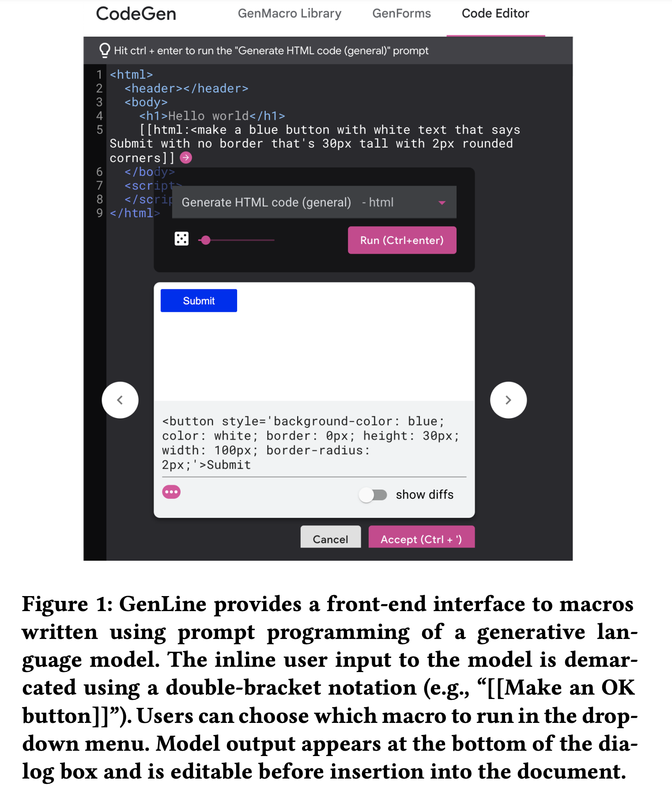
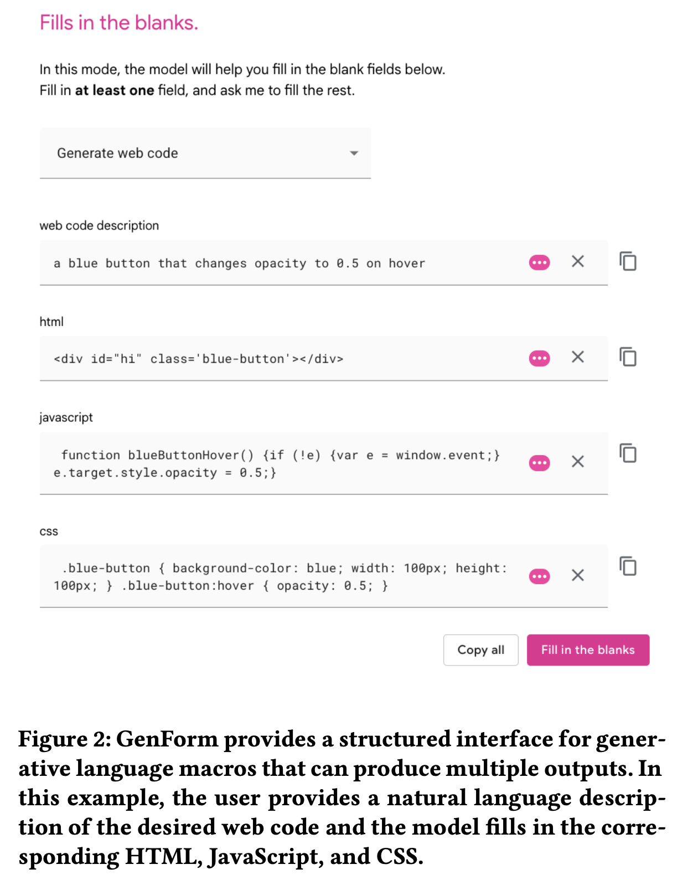

## What

This is a ideation paper where they proposed two tools for interacting with large language model in code editors.

- GenLine allows users to request code snippets inline with their code via natural language
- GenForm translates a natural language description to a structured forms with different code output (ie. written in different languages).

## Takeaway

- GenLine allows users to make a flexible request that is a mixed of code and natural language (e.g., "make this 30px tall <button>ok</button>)
- Other user interactions:
  - navigate multiple alternative outputs
  - edit model output before inserting to editor
  - transition to external resources when the model doesn't produce the desired output
    - this relates to one idea: scrape data when the person is older than xx. The age information needs to find on external resources (e.g., wiki of this person)

## Screenshots of the two tools:

