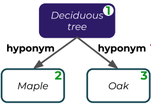

## What

This paper introduces a hybrid approach to make it more efficient for learning video creators to create prompts that are more diverse and and cover more comprehensively.

## Interesting nuggets

Promptivers adopts Ausubel's thoery on learning patterns which mainly states that knowledge is hierarchically organized, and so meaningful learning involes understanding the relationships between concepts and identifying new relations [1,2,3].

- A comment: based on Bloom's taxonomy, we can also add that learning should also involve applying and creating the relations.

In contrast, rote learning makes learners only memorize all the knowledge scatterly.

The paper gives an example of a piece of knowledge representing in a hierarchical way:

The learning theory also described three learning processes by which new knowledge is assimilated into the existing cognitive structure:

- superordinate learning: connecting examples to it. e.g., fruit: apple, orange, pear
- subordinate learning: subsume new information to prior knowledge in a hierarchical manner. e.g., watermelon => fruit
  - correlative subsumption: avocado is not sweet but is fruit => fruit can be non-sweet.
  - derivative subsumption: all types of fruit are grown from plants => any new type of fruit must be grown from some plants:
- combinatorial learning: learn that dog, cat are animal, which is not more inclusive nor specific than the fruit knowledge

Prior work has used this theory to design prompts at a high level, this work makes use of subsumption patterns to create prompts (i.e., the correlative and derivative subsumption)

### Creating prompts

knowledge element can be presented in a triplet: two entities and their relation. Apple is a type of fruit. Or what the authors called the entity of "shape of districtuion" and "modality" and the reltaion of "attribute".

<b>single prompt</b>

Hiding different parts of each element triplet:

<b> dyad of prompts</b>

Connecting simple prompts with a shared entity:

### Educational effective prompts

There are four kinds based on the Ausubel's theory

superordinate

subordinate (correlative)

subordinate (derivative)

combinatorial

## where

