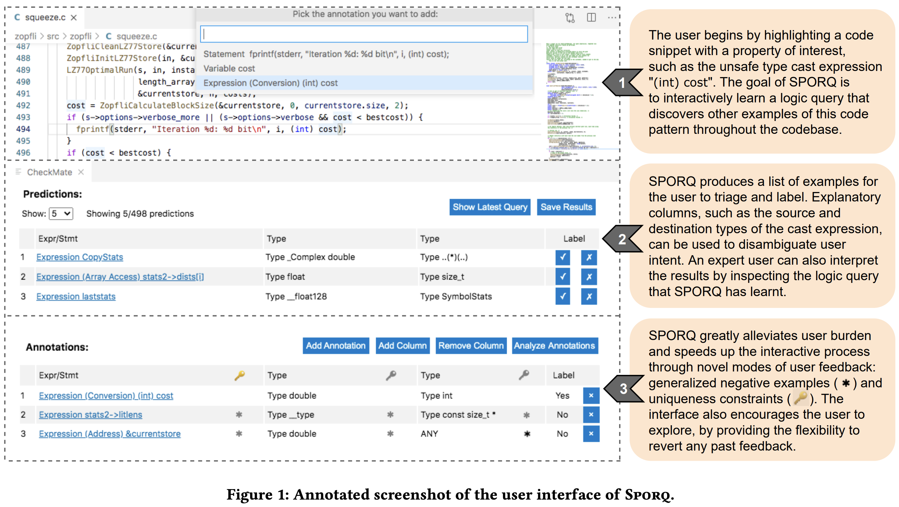
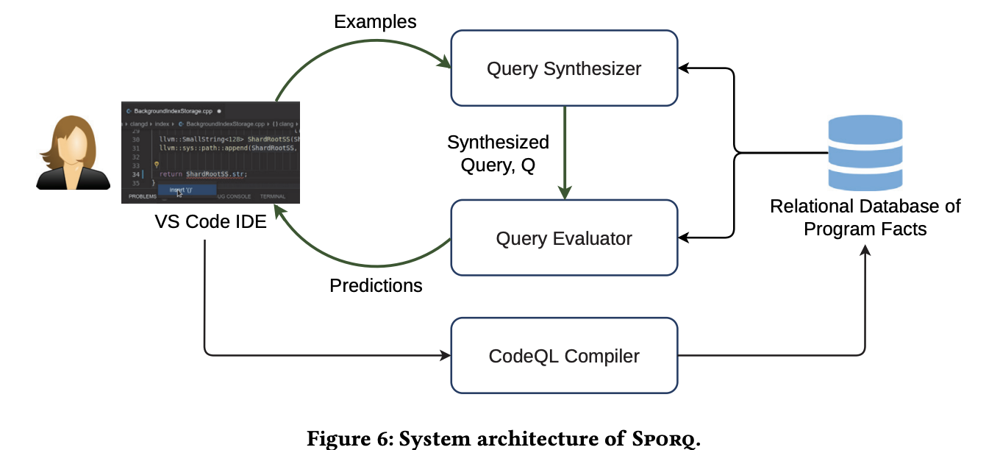

## what

This paper is quite similar to "Interpretable Program Synthesis" by Zhang et al. in UIST 2020 where they designed a query refinement system for developers to more accurate and quickly search code patterns in large codebase. The key user interaction novelty is that the system allows users to refine their intent by 1) annotating a batch of negative examples that are generated by the synthesizer (asterisk in the figure below), and 2) specific constraints (properties) of the generated examples (key button in each column).

## Motivation

The search space is often large, making the synthesis procedure slow and inefficient.

## Interaction flow

## Takeaways

- the spreadsheet like intent refinement interaction is interesting. typically we see this on websites like amazon where users can select those filters to narrow down their search results, but there's not mechansim to specify what they don't want which is what this paper introduced.
- the sample efficiency --- the number of labels needed to identify the desired query--- is also related to SemanticOn system. Users need to specify when the system should stop prompting them on new cases they've seen (default, a specific number, never). Also, how they want the system to handle the unseen cases after that (save as a batch, pause and notify immediately).
- this paper has technical evaluation, but SemanticOn will not have that. what happen when the user scraped data doesn't match with the ground truth?

## Where

