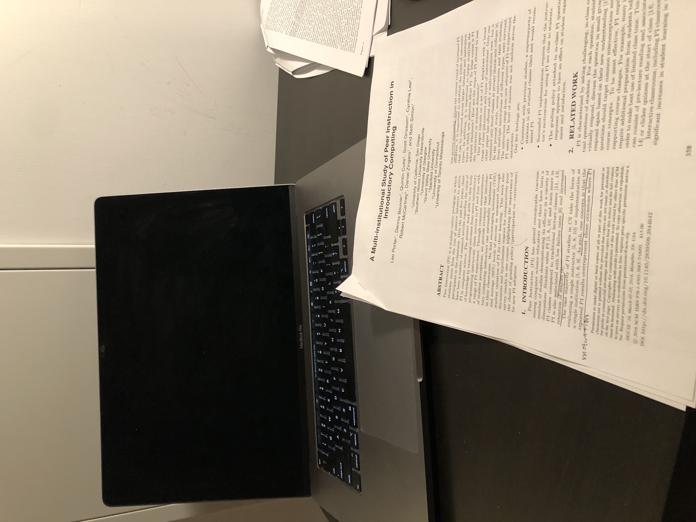

## What

This paper conducted a multi-institution (7) study to examine the outcomes from 7 instructors appling peer instruction (PI) in their intro to programming courses.

## Why

Most PI studies in CS evaluted a single instructor or at a single instituion. So the concern is whether the study reports overpresent the cases that PI has proven successful. Given the increasing adoption of PI practice, it's important to understand how it works at scale (e.g., across instituions).

## Study method

7 instructors applied PI in their own intro programming class for one semester. They self-reported and also surveyed the students regarding their PI experience. Of the 7 instructors, 3 had no little to zero PI implementation experience. They met with one PI expert in a weekly basis for the first half of the semester to learn and reflect.

## Most significant findings

- They confirmed that PI is helpful for students to engage and learn better.
- It's fairly important to explain to students that the clicker quesitons (PI) is not just to track them for attendence, but rather for them to engage in developing expert analysis and argumentation skills.
- Whether you grade the correctness of the clicker questions can make an impact on students' atitute to the PI practice.
  - 5 out of 7 instructors didn't grade the correctness but rather the attendence, and students had higher satisfactory overall.
  - For the other 2 instructors, one explained well to the students why the clicker question is important and applied "half correct" policy --- the class has to get at least 50% of the all questions in lecture correct to get their participation points. This practice was developed based on this instructor's prior experience: students may answer randomly or discuss non-related subjects in group discussion.
  - The other instructor (novice to PI) had poor students' feedback on the practice. Students felt the quiz questions were hard (yet prior work suggests that hard quiz works better for learning) and they didn't have enough time to read and solve the problem nor discuss with peers.

To conclude, when adopting PI, one needs to: explain well the purpose, and be careful about the implementation.

## Where

