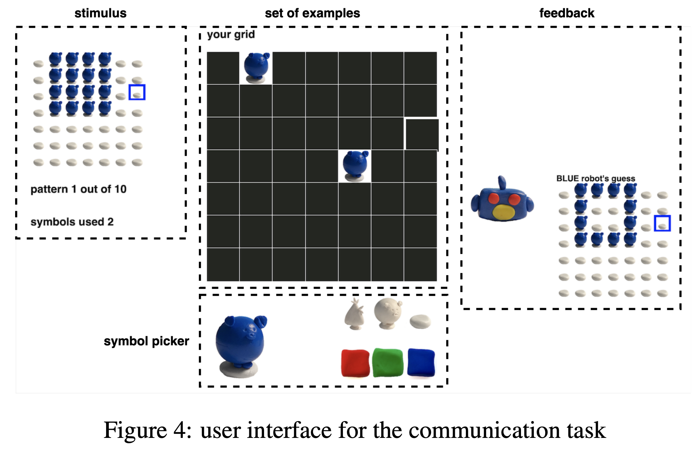

## What?

In order to more accurately and quickly (fewer shots) synthesize intended programs from users specification, this work recursively models the communication between the synthesizer and users' specifications from a pragmatic communication perspective.

## How?

Given a user specification, the algorithm ranks a candidate (synthesized) program over two dimensions: whether it can reproduce the specification (consistency), and how likely this specification occurs given this candidate program (pragmatic).

## Task

MTurkers, comparison between w. and wo. the pragmatic part.

## Benefits

This algorithm learns from users' specifications rather than being trained on prior user interaction data or relies on hand-crafted features.

## Future work

Adapt to users (interactively? not quite sure). Scale to more complex program synthesis domains (larger search space).

## Where?

