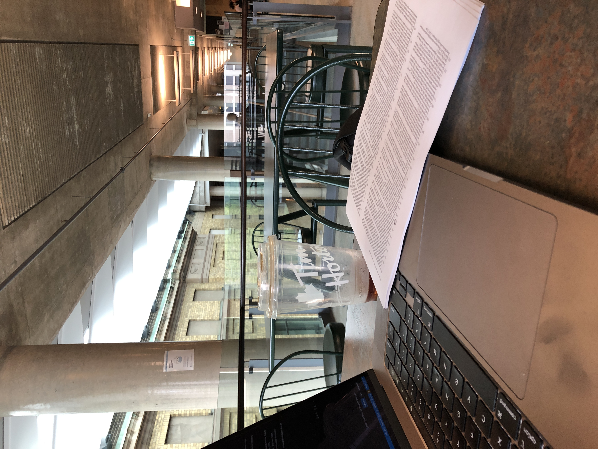

## what?

This paper did a controlled study with 32 swe to examine a generatice code model could help them improve productiviy on code translation task (java-to-python).

## why?

With the advanced generative code models, many users now have access to these powerful coding assistance. However, as these models often generate non-desired code which is different from how people interact with other systems that are deterministic, we need to better understand how human collaborate with these models so we know how to improve the collective effort and achieve superior outcomes to working alone.

## Main findings

Participants produced code with fewer errors than when working alone. But there's lots of inefficiency in the process.

## Suggestions

- Human factor aspect:
  - Future work can examine a broader range of indivisual factors that may impact one's ability to have successful joint outcomes when owrking with GCM.
    - thought: novices will have different experience
- intelligent presentation of multiple alternatives
  - multiple generated output may help users find errors in code, but it may also lead to more mental effort when juggling the similar-looking code translations.
  - presenting single output but highlighting the parts where alternate code/translation exists.
- Explainable generative model
  - Correspondences between the source Java and the AI's translation
    - using viz to highlight the mapping
- Societal implications
  - people's opinion/strategy on generative AI take their job
    - traditional SWE start to learn AI
  - argument: we shouldn't work because
    - HCI reserach uses human-centered framework to design these tools
    - human effort will be required to review, test, and approve a generative code models' output before it's included in a codebase
      - it's like how Google engineers will have their code review by others before integrating to the main codebase.

## References

- Bernt Bratsberg, Ole Rogeberg, and Vegard Skirbekk. 2021. Technology-induced
  job loss risk, disability and all-cause mortality in Norway. Occupational and
  Environmental Medicine (2021).
- Shana Lynch. 2021. Enhance, not Replace: AI’s Potential to Make Our Work – and
  Lives – Better. Retrieved October 2, 2021 from https://hai.stanford.edu/news/
  enhance-not-replace-ais-potential-make-our-work-and-lives-better.
- Henrik Schwabe and Fulvio Castellacci. 2020. Automation, workers’ skills and
  job satisfaction. Plos one 15, 11 (2020), e0242929.

## where

