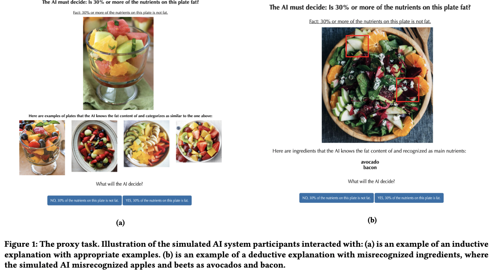
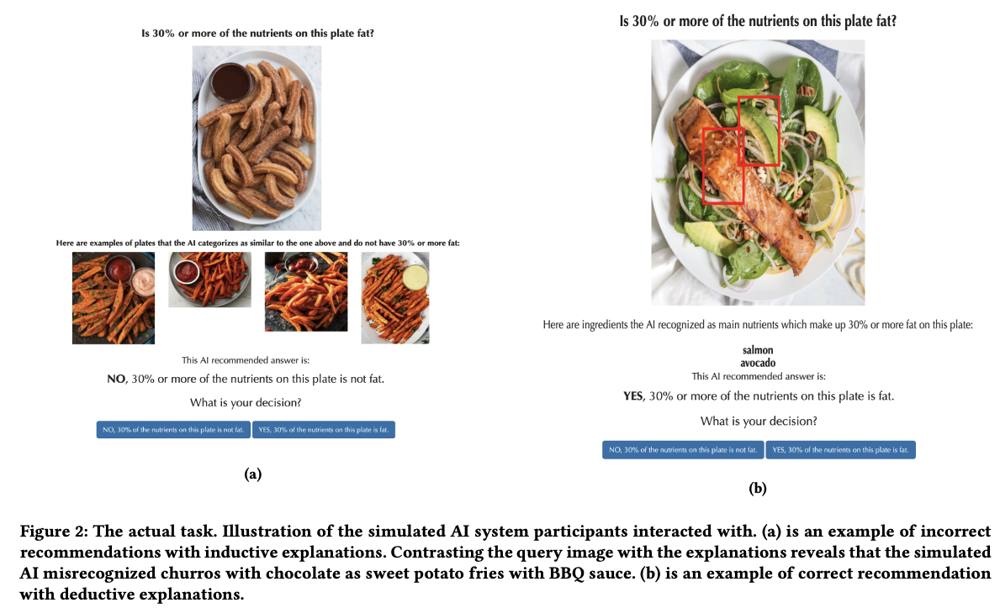
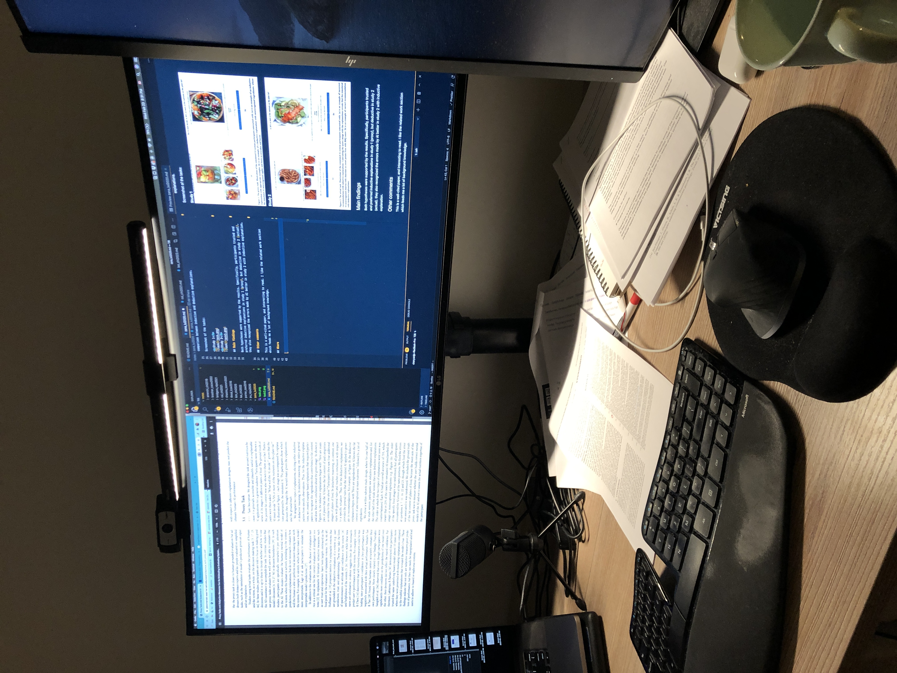

## What

This paper conducted 2 studies and an interview to examinate two hypothesis regarding the mistakes that some work has made in evaluating human-ai team performance: 1) using proxy tasks--- asking users to predict the AI's prediction rather than the performance together, 2) using human's trust and preferences on the AI's prediction rather than the objective measurements of the performance together.

## Motivation

Intuitively, human+ai teams should outperform either of them alone. However, there's evidence that human-ai teams often perform worse than AIs alone. To better understand this un-intuitive results, the authors suspected that this mismatch is in part due to a few mistakes (mentioned above) researchers made when conducting research.

## Hypotheses:

- H1: users' engagement on AI's prediction isn't gonna predict the overall task performance
- H2: self-reported trust and preference w.r.t. AI's predictions presentation may not predict the task performance

## studies

<b>Study 1</b>

- setup: Mturkers, within-subject, nutrition-related decision making tasks. Inductive explanation (showing examples) vs. deductive explanation (showing ingredients).
- measurements: 1) participants' correctness on AI's prediction, 2) participants' answers to ''AI's prediction is based on appropriate elements'' (Y/N), 3) Trust: ''i trust the AI to assess the fat content'' (0 - 5), and 4) mental demand on understanding AI's decisions, and 5) comparison between inductive and deductive.

<b>Study 2</b>

- setup: Mturkers, mixed of between (no AI recom.) and within-subject (AI with/w.o explanation), nutrition-related decision making tasks. Inductive explanation (showing examples) vs. deductive explanation (showing ingredients).
- measurements: 1) participants' correctness on AI's prediction, 2) participants' answers to ''i understand how AI made this prediction'' (0 - 5), 3) Trust: ''i trust the AI to assess the fat content'' (0 - 5), and 4) helpfulness of the AI system, and 5) comparison between inductive and deductive explanations.

Screenshot of the tasks:

<b>Study 1</b>

<b>Study 2</b>

## Main findings

Both hypotheses were supported by the results. Specifically, participants trusted and preferred inductive explanations in study 1 (proxy), but deductive in study 2 (actual). they also recognized the errors made by AI better in study 2 with inductive explanation.

## Other comments

This is a well-cited paper, and interesting to read. I like the related work section which feeds me a lot of background knowledge.

## Where

